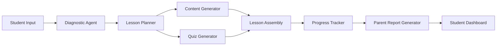

# Example 1: AI-Powered Tutoring App Workflow

## Scenario

A startup wants to build an AI tutoring app that:
1. Assesses a student's current knowledge in a subject
2. Creates a personalized learning plan
3. Delivers interactive lessons with explanations and quizzes
4. Tracks progress and adapts the plan
5. Generates a weekly report for parents/teachers

**Goal**: Design a multi-agent AI workflow that powers this app.
**Input**: Student selects "Algebra II" as their subject
**Constraints**: <$0.10 per student session, <5s latency for each interaction, must handle 10K concurrent students

---

## Phase 1: Discovery Output

```
GOAL: Build an AI tutoring system that assesses, plans, teaches, assesses again, and reports
SCOPE: Algebra II (scalable to other subjects)
INPUT: Student subject selection + initial diagnostic quiz answers
OUTPUT: Personalized lesson, quiz results, progress report, weekly parent summary
CONSTRAINTS:
  - Budget: $0.10/session max
  - Latency: <5s per interaction
  - Scale: 10K concurrent students
  - Security: FERPA compliance needed
SIGN-OFF: ✅ Confirmed
```

---

## Phase 2: Agent Design

### Agent 1: Diagnostic Agent
```yaml
name: diagnostic_agent
role: Assess current knowledge level and identify gaps
type: skills: quadcode.ai
assigned_to: auto
system_prompt: |
  You are a diagnostic tutor for Algebra II. You have access to the student's
  previous quiz results and current grade level. Your job is to:
  1. Analyze the student's diagnostic quiz answers
  2. Identify 3-5 knowledge gaps ranked by importance
  3. Recommend a starting point in the curriculum

  Output format: JSON with fields:
  - student_level (beginner/intermediate/advanced)
  - knowledge_gaps: [{topic, importance(1-5), description}]
  - recommended_starting_point (string)
user_prompt_template: |
  Student grade: {grade_level}
  Diagnostic answers: {diagnostic_responses}
  Topics covered this semester: {topics}
output_schema: |
  { "student_level": "intermediate",
    "knowledge_gaps": [
      {"topic": "quadratic_formulas", "importance": 5, "description": "Cannot derive from standard form"}
    ],
    "recommended_starting_point": "Unit 3: Quadratic Equations"
  }
tools: []
validation:
  - gate: validated knowledge_gaps has 3-5 items
  - retry_count: 1
  - escalation: human_review (if retries exhausted)
```

### Agent 2: Lesson Planner
```yaml
name: lesson_planner
role: Generate a structured lesson plan based on diagnostic output
type: skills: quadcode.ai
assigned_to: auto
system_prompt: |
  You are a curriculum designer for Algebra II. Given a student's knowledge gaps
  and starting point, design a lesson plan that:
  1. Starts from the recommended starting point
  2. Covers each knowledge gap in order of importance
  3. Includes one interactive exercise per concept
  4. Targets a 20-minute lesson duration
  5. Adapts difficulty based on student level

  Output: JSON with lesson_id, student_level, sections array, estimated_duration
user_prompt_template: |
  Diagnostic results: {diagnostic_output_json}
  Student preferences: {learning_style, session_duration}
output_schema: |
  { "lesson_id": "alg2-003",
    "student_level": "intermediate",
    "sections": [
      {"order": 1, "topic": "quadratic_formulas", "concept": "Standard form to vertex",
       "exercise_prompt": "Convert x^2+6x+5 to vertex form"}
    ],
    "estimated_minutes": 20
  }
validation:
  - gate: lesson covers all identified knowledge gaps
  - retry_count: 2
```

### Agent 3: Content Generator (Lumi for visuals)
```yaml
name: content_generator
role: Generate lesson content with visuals
type: tools: designer
assigned_to: lumi
system_prompt: |
  You are generating visual aids and diagrams for an Algebra II lesson.
  Create clear, pedagogically sound visualizations.
user_prompt_template: |
  Create a diagram showing the quadratic formula derivation from
  {lesson_concept}. Style: educational, clean, labeled axes where applicable.
tools:
  - alias: design_generate_icon
    purpose: Generate explanatory diagrams for math concepts
    inputs: Concept description, style, format (SVG preferred)
    output: Visual diagram as image file
output_schema: Image file or SVG diagram
```

### Agent 4: Quiz Generator
```yaml
name: quiz_generator
role: Generate post-lesson assessment questions
type: skills: quadcode.ai
assigned_to: auto
system_prompt: |
  You are an assessment designer. Create 5 multiple-choice questions
  that test understanding of the concepts covered in this lesson.
  Questions should range from basic recall to applied problem-solving.
user_prompt_template: |
  Lesson plan: {lesson_plan_json}
  Student level: {student_level}
  Generate 5 MCQs with:
  - Question text
  - 4 options (A-D)
  - Correct answer
  - Explanation for why correct/wrong
output_schema: |
  { "questions": [
    {"id": 1, "text": "...", "options": {"A":"...","B":"...","C":"...","D":"..."},
     "correct_answer": "B", "explanation_correct": "...", "explanations_wrong": {"A":"...","B":"...","C":"..."} }
  ]}
```

---

## Phase 3: Tool Selection

| Agent | Tool Need | Template Alias | Notes |
|-------|-----------|---------------|-------|
| Diagnostic | LLM analysis | (built-in) | Uses Quadcode.ai core LLM capability |
| Lesson Planner | LLM generation | (built-in) | Uses Quadcode.ai core LLM capability |
| Content Generator | Image generation | `design_generate_icon` | For math diagrams and graphs |
| Quiz Generator | LLM assessment | (built-in) | Uses Quadcode.ai core LLM capability |

---

## Phase 4: Prompt Engineering (Selected Templates)

### Diagnostic System Prompt (complete)
```
You are a Diagnostic Tutor specializing in Algebra II assessment.
You analyze student diagnostic results to identify knowledge gaps.

Rules:
1. Always identify exactly 3-5 knowledge gaps
2. Rank gaps by pedagogical importance (concepts that block learning others come first)
3. Recommend a specific starting point in the curriculum
4. Output ONLY valid JSON matching the output schema
5. Never provide answers to the diagnostic questions themselves
6. Consider the student's grade level when assessing

Output JSON format:
{
  "student_level": "beginner|intermediate|advanced",
  "knowledge_gaps": [
    {"topic": "string", "importance": 1-5, "description": "string describing the gap"}
  ],
  "recommended_starting_point": "string"
}
```

---

## Phase 5: Error Handling

```yaml
workflow_error_handling:
  agent_timeout:
    threshold: 15s
    action: retry 2x with exponential backoff (1s, 3s)
    escalate: log warning, use cached lesson plan if available

  quiz_generation_failure:
    threshold: 3 attempts
    action: fall back to template-based quiz from question bank
    escalate: notify content team

  content_generation_failure:
    threshold: 2 attempts
    action: generate text-only lesson without visuals
    escalate: flag for visual review

  budget_exceeded:
    threshold: $0.12 per session
    action: switch to lower-cost model tier
    escalate: daily budget report to ops
```

---

## Phase 6: Output Assembly

### Workflow Overview (Mermaid)



### Cost Analysis
```
Per-session cost breakdown:
- Diagnostic Agent: ~2K tokens → $0.002
- Lesson Planner: ~3K tokens → $0.004
- Content Generator: 1 image → $0.005
- Quiz Generator: ~2K tokens → $0.002
- Progress Tracker: ~1K tokens → $0.001
Total: ~$0.014 per session (well under $0.10 budget)
```

### Deployment Requirements
- FERPA-compliant data storage
- Student session caching (30 min TTL)
- Rate limiting: 100 req/s per agent
- Monitoring: Latency p95, cost per user, error rates
